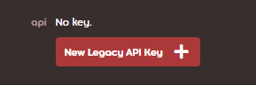
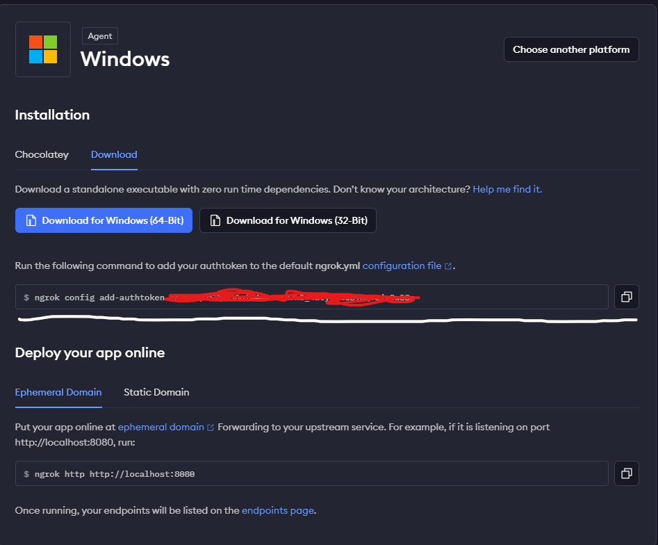
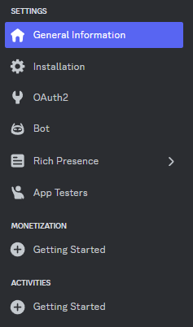
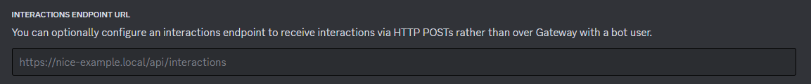

<div align="center">

# Tournoza

_A self-hostable, all-in-one osu! tournament bot_


</div>

# Setup

This guide assumes that you have already created your bot application and invited the bot to your tournament server.

## Prerequisites

- [Bun](https://bun.sh) - Our primary runtime <sub><sup>You're free to use [Nodejs](https://nodejs.org) if you like<sup><sub>
- [Git](https://git-scm.com/downloads) - Used to stay synced with the latest version of this project
- [Visual Studio Code](https://code.visualstudio.com/) - Convenient place to edit code <sub><sup>_Optional_</sup></sub>
- [Ngrok](#deploying-locally) - We need this to expose our **LOCAL** bot to the discord webhook api<sub><sup>_Optional_ Only needed if you plan to host the bot locally</sup></sub>
- [Vercel](#deploying-to-vercel) - <sub><sup>_Optional_ Only needed if you want to host the bot in the cloud</sup></sub> **Recommended**

- Acquired your **token** and **public key** from the discord.js guide on [Creating your bot account](https://discordjs.guide/preparations/setting-up-a-bot-application.html#creating-your-bot) and [Adding your bot to your server](https://discordjs.guide/preparations/adding-your-bot-to-servers.html)

## Creating a sheet

**WIP**

## Getting the Bot online

Assuming you've already gotten your [token](#prerequisites) and [public key](#prerequisites), the first thing we're going to need to do is clone the repo and install the dependencies:

```bash
git clone https://github.com/Artrix9095/tournoza

cd tournoza

bun install # If you used nodejs use npm here
```

Installing all the dependencies might take awhile, while you're waiting we should set up our _Environment Variables_ <sub><sup>env for short</sup></sub>

### Environment Variables

Rename the [.env.example](.env.example) file to just `.env`

And fill in your `BOT_TOKEN` and `BOT_PUBLIC_KEY` with there corresponding values you got earlier.

#### Creating a osu! API key

Head on to [you're osu! settings page](https://osu.ppy.sh/home/account/edit),
scroll all the way down and create a new Legacy API Key



type in your tournament name as your "application name" and `https://tournoza.vercel.app` as the application url.

Once you've created your API key, press "Show Key", copy the API key and paste it in .env file under `OSU_API_KEY`

#### Creating a service account

**WIP**

For now just watch [this video explaining it better than I can lmao](https://www.youtube.com/watch?v=tSnzoW4RlaQ).

**MAKE SURE YOU GIVE THE SERVICE ACCOUNT ADMIN OR OWNER ROLES. DO NOT RESTRICT ITS ACCESS LIKE THEY DO IN THE VIDEO**

Once you have your private key `.json` file, drag it into the project folder and rename it to `secrets.json` so the bot knows where to find it.

### Start the server

Once you have all the required environment variables and everything is configured, you can start the server with:

```bash
bun scripts/register.ts # Registers all the slash commands

bun run build && bun run start
```

If you plan to actively edit the code for the bot, run:

```bash
bun run dev
```

We're almost about halfway there. Now you just have to deploy it and link it to discord!

See the [Deployment](#deploying) section.

## Deploying

Vercel... or Local? Where should I run my bot?

_PSA: you don't have to use vercel, its just my personal preference, you are free to use things like [netlify](https://www.netlify.com/) as an alternative_

Well first, you need to ask yourself a few questions:

Are you looking for ease of deployment and management, or do you prefer more control over your environment? Running your Discord bot on Vercel offers simple deployment with automatic scaling and easy integration with GitHub for continuous deployment. However, running it locally gives you more control over the environment, allowing you to tweak settings and test locally before deploying changes. Consider your needs and preferences before deciding.

Overall, I recommend the Vercel option for most tournaments, especially beginners to programming.

### Deploying to vercel

**WIP**

#### Installing the CLI

```bash
bun install -g vercel # If you used nodejs use npm here

vercel login # Links your vercel account to the CLI
```

### Deploying Locally

When deploying to our local machine, we need our bot's URL to be publicly accessible so that discord can interact with it. To do this we need a proxy; this is where [Ngrok](https://ngrok.com/) comes in.

1. Firstly, you must create an account [here](https://dashboard.ngrok.com/)
   Afterwards it should prompt you to download the CLI. Do so and afterwards, run the command here:
   

2. [Start the bot server](#start-the-server)
3. Run `ngrok http 3000` and leave the terminal open.
4. [Link the URL ngrok gives you with your discord bot](#setting-up-interactions)

## Linking your deployment to discord

Hey remember that discord bot application you made earlier? We're going to need that so keep it open.

Make sure to keep your URL that you got from [the deployment section](#deploying) handy.

In the general information tab



Scroll down and enter in the "Interactions endpoint url" input your URL you got from [deploying](#deploying).


**MAKE SURE TO ADD THE FOLLOWING TO THE END OF THE URL**

`/api/interactions`

With this, you should end up with a URL similiar to `mytourny.vercel.app/api/interactions` or its Ngrok equivalent.

AND THATS ALL FOLKS, All slash commands should work in your tournament server! GLHF

&ensp;&ensp;&ensp;&ensp;\- Artrix
